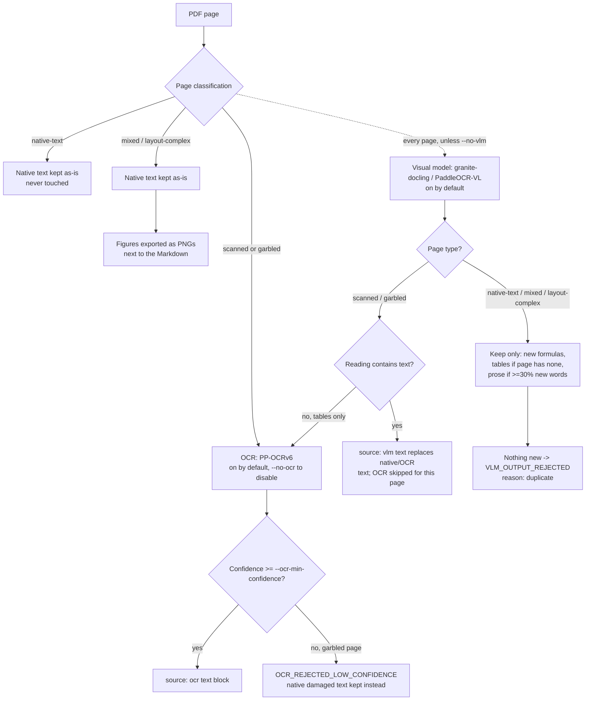

# Knowledge Extraction Pipeline — Faza 1

> **This repository (v.3) continues v.2 and adds OCR.** The full git history of v.2 is
> preserved here. OCR reads scanned PDF pages and image files; everything that worked
> before behaves exactly as it did.
>
> - Plan: [`docs/ocr-implementation-plan.md`](docs/ocr-implementation-plan.md) — the
>   design, the model investigation, and what changed during implementation.
> - Baseline: commit `d26469d`, tagged `v1.1-pre-ocr`. `tests/baseline/snapshot.json`
>   is generated from that tag and asserted on every run.

Extracts text and tables from local documents into JSON and Markdown. Runs 100%
locally, no cloud or external APIs. This is phase 1 of a future RAG system; the
output is designed to feed phase 2 (chunking + embeddings).

Every format produces the same internal model, so the JSON/Markdown output — and
phase 2 — is format-agnostic.

---

## 🚀 The Smart Way to Feed Documents to Your LLM

### Stop Wasting Money on Raw Files

Dumping large PDFs and spreadsheets directly into an LLM is expensive, unreliable, and opaque. This pipeline makes it transparent, efficient, and safe.

**Real numbers: 3 engineering PDFs (11.2 MB)**

| Approach | Tokens | Cost* | Quality |
|----------|--------|-------|---------|
| **🔴 Raw PDFs to LLM** | 2,810,051 | $0.42 per doc | ❓ Black box |
| **🟢 This Pipeline → Markdown** | **196,572** | **$0.03 per doc** | ✓ Verified |
| Savings | **93% fewer tokens** | **86% cheaper** | **Transparent** |

*Assuming $0.15/M tokens

**For 100 documents:** You save **$39** (and 262M tokens) while getting *better* results.

### Why Dumping Raw Files Fails

When you feed a PDF directly to an LLM:

| Problem | Raw PDF | This Pipeline |
|---------|---------|---|
| **What actually gets extracted?** | Unknown (black box) | You can inspect & verify |
| **Table structure preserved?** | Maybe mangled | Guaranteed — GFM or JSON |
| **Multi-column layouts?** | Random order (jumbled) | Column-aware reordering |
| **Scanned pages?** | Maybe OCR'd, maybe not | Explicit OCR + confidence scores |
| **Encoding errors?** | Silent corruption | Detected & reported |
| **Header/footer spam?** | Repeated on every page | Deduplicated once |
| **Quality visibility** | None | Full warnings & metadata |

**Result:** Raw PDFs are a black box. You don't know what the LLM actually sees.

### What You Get Instead

✅ **Transparent extraction** — inspect the JSON/Markdown, know exactly what the LLM sees  
✅ **Cleaner content** — no PDF artifacts, no encoding issues, tables intact  
✅ **Quality metadata** — OCR confidence, page classification, explicit warnings  
✅ **Structured output** — JSON for systems, Markdown for humans  
✅ **Reproducible** — same input always produces same output  
✅ **All formats** — PDFs, Excel, Word, PowerPoint use one pipeline  
✅ **Private** — runs 100% locally, zero cloud calls, zero data uploads

### No Data Loss—Actually Better Data

**Every byte of semantic content is preserved.** What's discarded:
- Font styling (not semantic)
- Watermarks & logos (visual noise)
- Low-confidence OCR fragments <3 chars (explicitly reported if it happens)

What's gained:
- Proper table structure (guaranteed)
- Correct reading order (column-aware)
- Quality signals (know what you're getting)

> See [`docs/data-loss-analysis.md`](docs/data-loss-analysis.md) for the full analysis — including edge cases, FAQ, and why this is actually safer than raw PDFs.

---

## For Non-Technical Users

**What this does:** you point it at a folder of documents (PDFs, Word files,
Excel sheets, PowerPoints, etc.) and it converts each one into two clean,
structured files — one JSON (for other software to read) and one Markdown (for
humans to read). No data ever leaves your computer.

**How to run it, step by step:**

1. Install [Python](https://www.python.org/downloads/) if you don't already
   have it (3.11 or newer).
2. Open a terminal in this project folder and set it up once:
   ```bash
   python -m venv .venv
   .venv/Scripts/python.exe -m pip install -r requirements.txt
   ```
3. Drop your documents into the `input` folder.
4. Run:
   ```bash
   .venv/Scripts/python.exe main.py
   ```
5. Check the `output/json` and `output/markdown` folders for your converted
   files. A log of what happened is saved in `logs/extraction.log`.

That's it — no accounts, no internet connection, no configuration required for
default use. If something fails, the tool skips that one file, tells you why in
the log, and keeps going with the rest.

## Supported Formats

| Format | Extension(s) | Library | Unit | Notes |
|--------|-------------|---------|------|-------|
| PDF | `.pdf` | PyMuPDF + pdfplumber | page | Text + tables, de-duplicated; figures rendered to `<stem>_images/` next to the Markdown and referenced inline (one file per figure, so a picture stored as several slices is saved whole, with the labels drawn over it); page classification. |
| CSV | `.csv` | stdlib `csv` | section | One table block; delimiter sniffed; encoding detected. |
| Word | `.docx` | python-docx | section | Paragraphs -> text, tables -> table, in document order. |
| Excel | `.xlsx`, `.xlsm` | openpyxl | sheet | One unit per worksheet; computed values, not formulas; macros ignored. `source_type` reports the real extension. |
| Plain Text | `.txt` | (stdlib) | section | Encoding-aware loading via charset-normalizer. |
| Markdown | `.md` | (stdlib) | section | Source passed through faithfully; encoding detected. |
| HTML | `.html`, `.htm` | BeautifulSoup + lxml | section | Headings/paragraphs -> text, tables -> table; scripts stripped. |
| PowerPoint | `.pptx` | python-pptx + OCR | slide | Text frames + tables + speaker notes per slide; grouped shapes traversed; slide pictures read by OCR. |
| JSON | `.json` | (stdlib) | section | Flat records -> table; nested -> indented text. |
| XML | `.xml` | defusedxml | section | Rendered as indented path/text; XXE refused. |
| Image | `.png`, `.jpg`, `.jpeg`, `.tiff`, `.tif`, `.webp` | Pillow + OCR | section | Read by OCR. Without OCR: valid output, zero text, explicit note. The default raster budget is 25 MP; larger images fail with `resource_limit` until adaptive resizing is enabled. |

## Page routing: OCR vs. the visual model

Every PDF page is classified once (`native-text` / `scanned` / `garbled` /
`mixed` / `layout-complex`), and that classification — not a per-file switch —
decides which reader touches the page, and what it's handed. **Both readers
always get the whole rasterized page, never a cropped snippet.** Figures are
exported separately as PNG files for a human (or a future VLM pass) to look
at; they are not fed back into OCR or the visual model.



**Defaults matter here**: OCR is *on* by default and only ever runs on
`scanned`/`garbled` pages. The visual model is also *on* by default
(`--no-vlm` turns it off) and reads *every* page — but keeps almost nothing
from most of them (see below). Both run locally with no per-call cost, so a
default run reads with PP-OCRv6, granite-docling and (Apple Silicon only)
attempts the visual model, downgrading with a visible warning where it isn't
available. Figure description (`--vlm-describe-figures`) stays opt-in — it is
the one step whose runtime cost is worth pausing over (roughly 45 s/page; see
below), not because it costs money.

## OCR

Scanned pages and image files hold pictures of text, not text. OCR reads them
locally — nothing is uploaded and nothing is downloaded at run time.

**It works out of the box.** The two PP-OCRv6 model files live in `models/ocr/`
and ship with the repository through git-lfs, so a fresh clone needs only:

```bash
git lfs pull                      # if your clone skipped large files
pip install -e ".[ocr]"           # onnxruntime, opencv, pyclipper, numpy
```

What OCR does, by page type:

| Page type | Behaviour |
|-----------|-----------|
| `native-text` | Never OCR'd — the text is already correct |
| `scanned` | Whole page rasterized and read |
| `garbled` | Read, and the OCR text replaces the damaged text when confidence >= `--ocr-min-confidence` |
| `mixed`, `layout-complex` | Native text is left alone and figures are exported as images. Their figures are read only under `--ocr-figures` |

**Recognized lines are put back in reading order, not left in the engine's.**
The detector sorts its boxes top-to-bottom, which is right on one column and
wrong on anything side by side: a two-column scan comes back with the columns
woven together line by line, so a chunker downstream splits neighbours and glues
strangers. Each line goes through the same column clustering that serves the PDF
text path (`reading_order.py`), with its pixel coordinates scaled to a nominal
page width so one set of thresholds covers both.

It is column clustering, not layout analysis, and the difference is measured. On
a 2x2 panel infographic — 148 lines across four panels — the engine's own order
switched panel 57 times, this switches 34, and perfect grouping would switch 3.
A strict improvement on every layout, a complete answer only on columns; a grid
of panels needs region segmentation, which is a much larger tool. Where the
clustering finds columns running side by side, the page reports
`OCR_MULTI_COLUMN` — precisely because that is the case where the order is
better than before and still not guaranteed right.

OCR text is a normal `text` block with its origin recorded, so it flows into
Markdown, metrics and phase 2 like any other text:

```json
{"type": "text", "content": "...", "source": "ocr", "confidence": 0.94}
```

**Without OCR nothing breaks.** If the extra is not installed or the model files
are missing, every affected page produces a warning naming the reason and the
fix — in the JSON, in a `<stem>.notes.md` sidecar next to the document's own
Markdown, and in the console summary. You get the same files, minus that text,
and you are told exactly what is missing. Never a crash, never a silently empty
page.

To replace the weights with a newer release (needs access to huggingface.co):

```bash
pip install -e ".[ocr-hf]"
python -m extractor.ocr.fetch_models
```

Model search order: `--ocr-model-dir` -> `$KE_OCR_MODEL_DIR` -> `models/ocr/` ->
`C:/Models/ocr` (Windows) -> `~/.cache/knowledge-extractor/ocr`. Naming a
directory explicitly disables the fallbacks, so a wrong path is reported rather
than silently replaced by a different model.

## Visual model (granite-docling, PaddleOCR-VL)

OCR reads glyphs. It cannot tell an equation from a caption, and it returns a
figure's axis labels as a bag of words. `--vlm` adds a second reader for that:
a document vision model run locally on Apple Silicon through `mlx`.

```bash
pip install -e ".[vlm]"           # mlx-vlm + torchvision; weights download on first use
python main.py                    # --vlm is on by default
python main.py --no-vlm           # native text + OCR only, no visual model
python main.py --vlm-model mlx-community/PaddleOCR-VL-1.6-4bit
```

Two models are supported, and the name selects the output format with it:

| `--vlm-model` contains | Model | Emits | Parser |
|---|---|---|---|
| `granite-docling` | `ibm-granite/granite-docling-258M-mlx` (default) | `<doctag>` stream | `doctag.py` |
| `paddleocr-vl` | `mlx-community/PaddleOCR-VL-1.6-4bit` (0.68 GB, 958M params) | Markdown | `markdown_doc.py` |

Any other name is refused with `VLM_UNAVAILABLE` naming the two it knows,
rather than parsed with the wrong reader and reported as an empty document.

**granite-docling is the default because it measured better where it counts.**
On 10 garbled pages of a 388-page course PDF, granite had 9 accepted and
recovered 33 formulas; PaddleOCR-VL had 1 accepted and recovered none. It emits
no LaTeX at all under whole-page prompting — its upstream pipeline detects
formula regions with a separate layout model first, and this pipeline gives it
whole pages. It also fell into repetition loops on 6 of those 10, against
granite's 1. PaddleOCR-VL remains available for documents where plain
transcription is the goal; it is not the better choice for formulas or for
recovering damaged pages.

The whole of that course has since been run through both, and the gap holds at
scale for one measurable reason — **PaddleOCR-VL runs out of tokens**. Same
document, same 4096-token cap, same 279 described pages:

| | granite-docling | PaddleOCR-VL |
|---|---|---|
| Pages kept (`VLM_APPLIED`) | 170 | 131 |
| Formulas recovered | 478 | **827** |
| Rejected as truncated | 12 | 143 |
| Pages falling through to OCR | 2 | 24 |

**PaddleOCR-VL recovers more formulas than granite, on fewer pages.** That
reverses this table's earlier reading, which counted 57 against 478 and was
wrong: `markdown_doc._FORMULA` matched `$$…$$` and `\[…\]` only, and this
model writes most of its maths *inline* as `\(…\)`. 486 formulas per run were
invisible to the count and — because counting and validating are one pass —
skipped `formula_is_balanced` entirely. Counting them also stopped 29 pages
being discarded as duplicates that had contributed nothing but their equations,
which is why the page count rose from 102.

Inline formulas are counted where they stand, not promoted to display blocks:
338 of the 486 sit inside a sentence (`…for z = 0, \(p_a = q K_a = 10,15\)
kN/m²`), and lifting one out would cut its sentence in half. granite emits no
inline maths at all, so the comparison above is like-for-like.

Markdown costs far more tokens than a doctag stream on a dense page, so the cap
binds on 58% of PaddleOCR-VL's attempted pages against granite's 5%, and a
truncated page is rejected back to its native text. The OCR column is the same
cause downstream: a rejected page never suppresses the OCR pass. Whether raising
`--vlm-max-tokens` closes the gap is untested — the comparison above is of the
shipped defaults, and the default stands on those.

Neither model should be trusted on URLs: on that run granite invented 11 of the
13 URLs in its kept text and PaddleOCR-VL 8 of 9, in well-formed and entirely
plausible form. See CLAUDE.md's merge-rule section.

A page-level diff of the two runs refines the picture further, and not in
granite's favour on quality:

- **They read different pages, not more and fewer of the same ones.** Of the
  221 pages one model or the other kept, only 50 were kept by both — 119 are
  granite-only, 52 PaddleOCR-VL-only. Granite's extra pages are real content
  (98,746 chars, median novelty 1.00 against their own native text, 333 formula
  blocks), so its coverage advantage is genuine. But PaddleOCR-VL reads 52 pages
  granite drops entirely.
- **On the pages both read, PaddleOCR-VL is the more accurate transcriber.** It
  kept more text there (66,029 chars against 53,504) and the two agree on only
  9 of 50 pages. On page 315 granite collapsed one equation into scrambled
  tokens (`10, 4046 25 0, 6 1 a p K q K`) and dropped a factor from the next —
  writing `γ₁·H₁ + q·K_a1` for arithmetic that computes `γ₁·H₁·K_a1 + q·K_a1`.
  That formula is *balanced*, so `formula_is_balanced` passes it: a silently
  wrong equation, which is the failure this pipeline treats as worse than a
  missing one. PaddleOCR-VL rendered both correctly.
- **granite damages Romanian text; PaddleOCR-VL does not.** It splits words
  around diacritics — `Exist ă ș i instala ț ii` — 848 times across 28 pages,
  against PaddleOCR-VL's zero. This also defeats the redundancy gate, whose
  `_words` drops tokens of 3 characters or fewer: the split fragments score as
  novel, so ~21,700 chars of duplicated prose shipped on 10 of 136 additive
  pages.

granite remains the default: coverage is the larger effect, and the truncation
that costs PaddleOCR-VL 143 pages is a property of the shipped cap. But on a
diacritic-heavy or formula-critical document, check PaddleOCR-VL before assuming
the default is better — on the pages both models read, it was.

Off by default, and slow — roughly 5–14 s per page, so a 400-page book is most
of an hour. Every inference is cached under
`~/.cache/knowledge-extractor/vlm`, keyed on the rendered page, so an
interrupted run resumes instead of starting over.

**Every page is read, but almost nothing is kept.** That is deliberate. The
model returns the native text back to you 92–100% word for word on a healthy
page; publishing that beside the text it copies would double the document and
add nothing. So its output is filtered by what the page does not already hold:

| Page type | What is kept |
|-----------|--------------|
| `scanned`, `garbled` | The whole reading **replaces** the untrusted native text, and OCR skips the page — two recovery paths on one page would print it twice. If the reading has no text (tables only), OCR still runs |
| everything else | Formulas, and tables only where the page has none. Prose is kept only when at least 30% of its words are new, and a page left with nothing is rejected as a duplicate |

Native tables always win: pdfplumber reads the ruling lines, the model infers
them. Accepted text is a normal `text` block with `"source": "vlm"`, so it
flows into Markdown, metrics and phase 2 like any other text.

**Without it nothing breaks.** No `mlx-vlm`/`torchvision`, a non-Apple-Silicon
host, or `--no-vlm`, and the probe fails with a typed reason — visibly, in the
console summary as well as the JSON — and the output is exactly what it would
have been otherwise.

### Describing figures (`--vlm-describe-figures`)

Everything above reads what a page *says*. Nothing in the pipeline says what a
chart *shows* — the text layer holds its axis labels and nothing else, OCR under
`--ocr-figures` returns those same labels as fragments, and granite emits
`<picture>` and moves on. A paragraph describing the figure is what Phase 2
wants to embed, and this is the only path that produces one.

```bash
python main.py --vlm-describe-figures
```

The prompt asks for the description **in the same language as the page's own
text**, so a Romanian document gets a Romanian description, not an English one
by default — the model is multilingual and follows the page rather than
defaulting to English.

It works on image files too — a screenshot or a reference card is exactly the
case where the glyphs are only half the content. There it is **additive only**,
with no reading model beside it: an image's text comes from OCR, which is
*trusted* output, unlike the native text of a `scanned` PDF page that the model
is allowed to replace. Handing the same picture to a conversion model would bet
verified text against an unmeasured reading, and would put the "who wins here"
rule in a second place besides `pdf_reader`.

It loads a second model beside the reading one —
`mlx-community/Qwen3-VL-8B-Instruct-4bit` by default, override with
`--vlm-describe-model` — and sends every page that is classed `mixed` /
`layout-complex` **or** carries an embedded image. Output is a `text` block with
`"source": "vlm-figure"`, placed after the page's own text: it is commentary on
the page, and a reader (or a chunker) wants the source first.

A real page of the reference course comes back as:

> A map of Romania illustrates the distribution of peak ground acceleration
> (a_g) for seismic events, with contour lines indicating acceleration values in
> units of g (gravity). The map, sourced from UTCB, 2012, and scaled at
> 1:3,000,000, shows regions with varying seismic intensity, ranging from 0.10g
> to 0.40g...

**A figureless page is refused by the model, not by a heuristic.** Asked for the
graphics on a page that has none, it answers `NONE` and that page is skipped.
This is the cheapest gate available — there is no region signal to threshold,
because there are no regions (see below) — but it is a prompt instruction rather
than a guarantee, so it was measured rather than trusted. Across 26 pages spread
through the 388-page course: 8 refusals, all of them the bare sentinel, 18
descriptions (median 1,420 characters), and **zero refusals phrased as prose**
("there are no figures on this page"), which is the form that would slip past
the check and publish as a figure block saying nothing. None hit the 512-token
cap either.

**Why the whole page and not each figure.** Cropping to each figure was the
obvious design and the corpus killed it: `raster.page_image_regions` finds zero
regions on 16 of 17 pages of the reference deck, whose figures are vector art
with no embedded raster, and granite's own `<picture>` boxes on those pages are
logos — 12x11 units — and absent entirely on two pages that do have figures.

**Three costs to know before turning it on.** Roughly 45 s per page sent,
against granite's 5–14 s. A second set of weights resident alongside the first
(measured peak 7.4 GB for both, granite + the 4-bit Qwen). And — the one that
actually bites — *most of an illustrated document qualifies*: on the 388-page
reference course the gate sends **330 pages**, about four hours. The per-page
figure is the harmless half of that number; budget from the page count. Point
`--input` at the subset you want rather than a whole library, and note that
inferences are cached like every other, keyed on the model, so an interrupted
run resumes and the describing pass never collides with the reading pass over
the same pixels.

**It will not describe a page whose "figures" are boxes and rules.** On the
17-page reference deck — 10 pages of which classify as `layout-complex` — the
model answered `NONE` on every one, correctly: its diagrams are text in styled
containers, and the table on page 15 is a table, which the table path already
handles. The gain is on documents with real graphics: charts, maps, photographs,
schematics.

## Setup

```bash
python -m venv .venv
.venv/Scripts/python.exe -m pip install -r requirements.txt
```

This installs the project in editable mode with all dev dependencies (pytest,
pytest-cov, ruff). Tested on Python 3.14 (Windows).

## CLI Usage

```bash
# Defaults: input/ -> output/, logs to logs/extraction.log
.venv/Scripts/python.exe main.py

# Custom directories and limits
.venv/Scripts/python.exe main.py --input docs --output out --max-file-mb 5

# All options
.venv/Scripts/python.exe main.py \
    --input INPUT_DIR \
    --output OUTPUT_DIR \
    --log-file logs/extraction.log \
    --max-file-mb 50 \
    --verbose
```

| Flag | Default | Description |
|------|---------|-------------|
| `--input` | `input` | Directory containing input files |
| `--output` | `output` | Root output directory (json/ and markdown/ subdirs) |
| `--log-file` | `logs/extraction.log` | Path to log file |
| `--max-file-mb` | 50 | Skip files larger than this (MB) |
| `--verbose` / `-v` | off | Set log level to DEBUG |
| `--no-ocr` | off | Do not read scanned pages or image files |
| `--ocr-figures` | off | Also read the pictures on `mixed` / `layout-complex` pages. On chart-heavy documents this returns mostly axis labels; on infographic decks the figure holds the page's only text |
| `--ocr-model-dir` | auto | Directory holding the detection and recognition `.onnx` files |
| `--ocr-dpi` | 300 | Resolution used to rasterize scanned pages |
| `--ocr-min-confidence` | 0.60 | Below this, OCR text is flagged uncertain and never replaces damaged native text. Applied to the page average and to each line individually |
| OCR raster budget | 25 MP | Hard limit per rasterized image/page. Larger inputs fail as `resource_limit`; adaptive resizing is planned but not enabled |
| `--vlm` / `--no-vlm` | on | Read every page with a visual model too (Apple Silicon only; downgrades with a visible warning elsewhere) |
| `--vlm-model` | `ibm-granite/granite-docling-258M-mlx` | Model to load; the name must contain `granite-docling` or `paddleocr-vl` |
| `--vlm-dpi` | 144 | Resolution used to render pages for the model |
| `--vlm-repetition-penalty` | `1.05` | Penalty on repeated tokens; stops the repetition loops both models fall into on damaged pages. `1.0` disables it |
| `--vlm-max-tokens` | 4096 | Token budget per page |
| `--vlm-cache-dir` | `~/.cache/knowledge-extractor/vlm` | Where per-page inferences are cached |
| `--vlm-describe-figures` | off | Also describe what each figure *shows*, in the page's own language. Loads a second model; ~45 s/page, so it stays opt-in |
| `--vlm-describe-model` | `mlx-community/Qwen3-VL-8B-Instruct-4bit` | Model used for figure description |

Oversized files are skipped with a structured fatal category and counted as
failures in the summary — the batch continues. Fatal categories are
`unsupported`, `malformed`, `encrypted`, `resource_limit`, `missing_part`, and
`io`. Fatal failures are not stored as warnings on a document that was never
created.

A workbook that would expand past 500,000 rows or 5,000,000 cells in memory is
refused the same way. `--max-file-mb` measures the compressed size, and XLSX
compresses roughly 10:1, so a 40 MB workbook clears a 50 MB cap and can still
exhaust memory. It is refused rather than truncated: a partial workbook is
silently wrong, and an out-of-memory failure would end the whole run instead of
one file.

### Exit codes

The run returns a process exit code, so a scheduler, CI step or launcher can
tell a failed batch from a clean one.

| Code | Meaning |
|------|---------|
| 0 | Every discovered file processed. An input directory with no supported files is also 0 — nothing to do is not a failure |
| 1 | At least one file failed (oversized, corrupt, unreadable structure). The rest still produced output |
| 2 | The run could not start: the input directory does not exist |

## Tests

```bash
# Full suite with coverage
.venv/Scripts/python.exe -m pytest --cov=extractor

# Golden corpus only (semantic metric assertions)
.venv/Scripts/python.exe -m pytest tests/golden -v

# Skip slow tests
.venv/Scripts/python.exe -m pytest -m "not slow"

# Run a specific test file
.venv/Scripts/python.exe -m pytest tests/test_new_readers.py -v

# Lint
.venv/Scripts/ruff check .
```

### Test structure

```
tests/
├── conftest.py                 # Shared fixtures (runtime-generated samples)
├── baseline/
│   ├── generate.py             # Rebuilds the pre-OCR output snapshot
│   └── snapshot.json           # Committed output from the v1.1-pre-ocr tag
├── golden/
│   ├── conftest.py             # Edge-case corpus fixtures (PDF, DOCX, XLSX)
│   └── test_golden.py          # Semantic metric threshold assertions
├── metrics.py                  # Quality measurement functions
├── test_baseline_snapshot.py   # Output unchanged vs the pre-OCR baseline
├── test_cli.py                 # CLI argparse + integration tests
├── test_csv_reader.py          # CSV reader unit tests
├── test_dispatcher.py          # Extension routing, unsupported type
├── test_docx_quality.py        # DOCX quality edge cases (tracked changes, etc.)
├── test_docx_reader.py         # DOCX reader unit tests
├── test_edge_cases.py          # Output-correctness probes, incl. confirmed-defect xfails
├── test_end_to_end.py          # Full pipeline integration
├── test_errors.py              # Fatal error classification/categories
├── test_format_detection.py    # PDF/RTF/OOXML strong-signature validation
├── test_formula_rendering.py   # doctag/markdown formula-wrapping regressions
├── test_geometry.py            # Bounding-box overlap (parametrized)
├── test_headers_footers.py     # Side-margin label + repeated-line detection
├── test_image_limits.py        # Raster pixel-cap enforcement
├── test_json_writer.py         # JSON output writer
├── test_limits.py              # File size guard + FileTooLargeError
├── test_markdown_writer.py     # Markdown output writer
├── test_model.py               # Model constructor tests
├── test_new_readers.py         # txt, md, html, pptx, json, xml readers
├── test_normalizer.py          # Core normalize() rules
├── test_normalizer_extended.py # normalize_with_report + ftfy (parametrized)
├── test_ocr_apply.py           # OCR reader/engine glue, fake engine
├── test_ocr_config_limits.py   # OcrConfig pixel-cap defaults
├── test_ocr_core.py            # CTC decode, dictionary, path resolution
├── test_ocr_dbnet.py           # Detection post-processing on a synthetic map
├── test_ocr_engine.py          # Recognition-input prep, stub ONNX session
├── test_ocr_integration.py     # Real model round trip (slow, auto-skipped)
├── test_ocr_pipeline.py        # Behaviour with/without OCR available
├── test_ocr_raster.py          # Page/figure/image rasterization
├── test_ocr_registry.py        # OCR probe: every unavailability path, never raises
├── test_pdf_reader.py          # PDF reader + deduplication
├── test_robustness.py          # Malformed-input resilience
├── test_rotated_text.py        # Vertical-text extraction and its wiring
├── test_secondary_findings.py  # Regressions for the 2026-08-31 code audit
├── test_table_limits.py        # MAX_TABLE_CELLS enforcement
├── test_table_reader.py        # Table detection + filtering
├── test_text_loader.py         # Encoding detection (charset-normalizer)
├── test_vlm_apply.py           # Visual-layer routing/rejection/caching, stub engine
├── test_vlm_describe.py        # Figure description: page selection, NONE gate
├── test_vlm_doctag.py          # granite-docling doctag parsing/validation
├── test_vlm_engine.py          # MlxVlmEngine + render_page, truncation signal
├── test_vlm_markdown.py        # PaddleOCR-VL Markdown output parsing
├── test_vlm_pipeline.py        # Visual-layer blocks reaching JSON/Markdown
├── test_vlm_registry.py        # Visual-model probe: every unavailability path, never raises
├── test_warning_text.py        # Warning-code -> human-readable sentence rendering
└── test_xlsx_reader.py         # Excel reader unit tests
```

Markers registered in `pyproject.toml`: `slow`, `integration`.

## Warning Codes

The pipeline emits structured warnings on the document model when it detects
potential quality issues:

| Code | Trigger |
|------|---------|
| `SCANNED_PAGE_NO_TEXT` | Image area ratio high, text chars below threshold |
| `MIXED_CONTENT_PAGE` | Meaningful text plus large image coverage |
| `GARBLED_TEXT` | Replacement/non-printable ratio above threshold |
| `MISMAPPED_GLYPHS` | A symbol font on this page decoded to unrelated alphabets — its formulas and special characters are unreliable; `scripts` names them |
| `POSSIBLE_TWO_COLUMN_ORDER` | More than one column cluster detected |
| `LAYOUT_COMPLEX` | Many ruling lines or many font variants |
| `HEADER_FOOTER_DETECTED` | Repeated signature found (document-level) |
| `ENCODING_FALLBACK` | The encoding had to be guessed — a legacy codepage was inferred, or the decode still looks implausible. Plain ASCII/UTF-8 never triggers it |
| `UNICODE_REPAIRED` | ftfy changed the text |
| `NESTING_TRUNCATED` | A JSON/XML document nests deeper than the reader renders; the deepest levels were cut rather than failing the file |
| `OCR_APPLIED` | OCR read this page — carries the engine and the confidence averaged over every recognized line |
| `OCR_LOW_CONFIDENCE` | Whole-page OCR mean below `--ocr-min-confidence` — check it before relying on it |
| `OCR_REJECTED_LOW_CONFIDENCE` | A garbled page was OCR'd but the reading scored below `--ocr-min-confidence`, so it was discarded — the page holds no recovered text |
| `OCR_MIXED_CONFIDENCE` | Page mean passes, but some lines are below the threshold — carries how many, and the worst |
| `OCR_NOISE_FILTERED` | Unreadable 1–3 character fragments were discarded — carries how many, and quotes a sample |
| `OCR_MULTI_COLUMN` | The page was read as multiple side-by-side columns, so the recognized lines were reordered — check the order, since a panel grid is only partly untangled |
| `OCR_UNAVAILABLE` | OCR was needed but cannot run — `detail` names the reason |
| `OCR_SKIPPED_DISABLED` | OCR was needed but `--no-ocr` was given |
| `OCR_MODEL_INCOMPATIBLE` | Model class count does not match the dictionary — decoding refused |
| `OCR_FAILED` | OCR raised on every image on this page — nothing was read |
| `OCR_IMAGE_FAILED` | OCR raised on some images on this page; text from the rest was kept |

Fatal extraction categories are reported separately from warnings:

| Category | Meaning |
|----------|---------|
| `unsupported` | The extension is not supported |
| `malformed` | A strong file signature or package is invalid |
| `encrypted` | The package requires a password or cannot be opened because it is encrypted |
| `resource_limit` | A configured file, workbook, JSON, XML, image, or table budget was exceeded |
| `missing_part` | A required package member is absent |
| `io` | The file could not be read from the filesystem |
| `VLM_APPLIED` | The visual model's reading of this page was kept — carries the formula count, and says when its prose was dropped as a repeat of the page text |
| `VLM_OUTPUT_REJECTED` | Its reading was discarded — per-page with `reason` `truncated`, `low-yield`, `empty` or `error`; `duplicate` is aggregated once per document instead, with a `pages` count |
| `VLM_UNAVAILABLE` | The visual model was requested but cannot run — `detail` names the reason |
| `VLM_FIGURES_DESCRIBED` | `--vlm-describe-figures` produced a description — aggregated once per document with a `pages` count |
| `VLM_DESCRIBE_TRUNCATED` | Some descriptions hit the token cap and stop mid-sentence — they are kept, since a description cut after two figures still describes two, but the cut is reported because prose that stopped looks like prose that ended |
| `VLM_DESCRIBE_FAILED` | Some figure pages raised during description and were skipped; the rest are unaffected |
| `VLM_DESCRIBE_UNAVAILABLE` | The describing model could not be loaded — `detail` names the reason, and the run is otherwise unchanged |
| `FORMULA_REVIEW_REQUIRED` | A formula came back with unmatched `\left`/`\right` and was dropped rather than published wrong — check the source page |
| `VLM_URL_UNVERIFIED` | A URL in the visual model's text is not confirmed by native text or OCR on the same page — carries the URL, and the closest one from another source when there is one close enough to guess it's the same link misread |

Warnings appear in the JSON output (`document.warnings`), in a `<stem>.notes.md`
sidecar next to the document's own Markdown (kept out of the document itself so
a future Phase 2 chunker never ingests "OCR confidence 81%" as document prose),
and in the console summary — the same information in all three places, in
plain language.

## Output Shape

One JSON + one Markdown per input file, named after the input's stem (e.g.
`doc.pdf` -> `doc.json` / `doc.md`). If two inputs in the same run share a
stem (`report.pdf` and `report.docx`), each output is disambiguated with the
source extension instead (`report-pdf.json`, `report-docx.json`) so neither
document is silently overwritten.

Internal model:

```json
{
  "document": {
    "filename": "doc.pdf",
    "source_type": "pdf",
    "pages": 8,
    "author": "",
    "title": "",
    "has_images": true,
    "image_count": 25,
    "schema_version": "2.0",
    "warnings": [
      {"code": "POSSIBLE_TWO_COLUMN_ORDER", "page": 3},
      {"code": "HEADER_FOOTER_DETECTED"}
    ]
  },
  "pages": [
    {
      "unit": 1,
      "unit_type": "page",
      "has_images": true,
      "image_count": 2,
      "page_class": "native-text",
      "content": [
        {"type": "header", "content": "Company Name"},
        {"type": "text", "content": "..."},
        {"type": "table", "content": [["Rol","Actiune"], ["Manager","Aproba"]]},
        {"type": "footer", "content": "Page 1"}
      ]
    }
  ]
}
```

### New in schema 2.0

- `schema_version` on the document node
- `page_class` per unit: `native-text` / `scanned` / `mixed` / `garbled` / `layout-complex`
- `warnings` list on the document node (omitted when empty)
- `header` / `footer` block types (preserved in JSON, excluded from Markdown)

### Block types

| Type | In JSON | In Markdown | Description |
|------|---------|-------------|-------------|
| `text` | yes | yes | Normalised text content |
| `table` | yes | yes (GFM table) | List of rows (list of cell strings) |
| `header` | yes | no | Repeated page header (detected) |
| `footer` | yes | no | Repeated page footer (detected) |

## Architecture

```
input/*.{pdf,csv,docx,xlsx,xlsm,txt,md,html,pptx,json,xml}
   |
   v
dispatcher.extract_document(path)
   |
   +-- .pdf  -> pdf_reader     (PyMuPDF text + pdfplumber tables + signals)
   +-- .csv  -> csv_reader     (charset-normalizer + stdlib csv)
   +-- .docx -> docx_reader    (python-docx)
   +-- .xlsx/.xlsm -> xlsx_reader (openpyxl)
   +-- .txt  -> txt_reader     (charset-normalizer)
   +-- .md   -> md_reader      (charset-normalizer, pass-through)
   +-- .html -> html_reader    (BeautifulSoup + lxml)
   +-- .pptx -> pptx_reader    (python-pptx)
   +-- .json -> json_reader    (stdlib json)
   +-- .xml  -> xml_reader     (defusedxml)
   |
   v   (internal model, via model.py constructors)
   +-- json_writer     -> output/json/<name>.json
   +-- markdown_writer -> output/markdown/<name>.md
```

### PDF-specific modules

| Module | Role |
|--------|------|
| `page_signals.py` | Compute per-page signals (text chars, image area, fonts, ruling lines) |
| `reading_order.py` | Column-aware word reordering (cluster blocks into columns) |
| `headers_footers.py` | Detect repeated header/footer lines by signature |

## Dependencies

### Runtime (pinned in pyproject.toml)

`pymupdf`, `pdfplumber`, `python-docx`, `openpyxl`, `charset-normalizer`,
`ftfy`, `defusedxml`, `beautifulsoup4`, `python-pptx`, `pillow`

### OCR — optional extra `[ocr]`

`onnxruntime`, `opencv-python-headless`, `pyclipper`, `numpy`

### Visual model — optional extra `[vlm]`

`mlx-vlm` (which pulls `mlx` and `transformers`) plus `torchvision`, declared
explicitly — granite-docling's default image processor
(`Idefics3ImageProcessor`) needs it and `mlx-vlm` does not pull it in on its
own; without it the engine fails to load and `--vlm` silently produces no
visual-model output. Apple Silicon only. The weights are fetched from Hugging
Face the first time the visual model runs and cached locally after that.

### OCR model refresh — optional extra `[ocr-hf]`

`huggingface-hub`. Only used by `python -m extractor.ocr.fetch_models`; the
pipeline itself never imports it and never reaches the network.

### Dev

`pytest`, `pytest-cov`, `ruff`

### Notes

- `lxml` arrives transitively via `python-docx` — used by BeautifulSoup as the
  HTML parser.
- `Pillow` and `XlsxWriter` arrive transitively via `python-pptx`.
- `defusedxml` protects only the `.xml` reader; docx/xlsx parse through lxml
  internally (size caps are the guard there).

## Out of Scope (Phase 1)

Legacy binary `.doc`/`.xls`/`.ppt` are not supported. Handwriting is not a
target — the OCR model is trained on printed text. Embeddings, vector DB,
semantic search, and LLM integration are Phase 2+.


RUN:  PowerShell(cd D:\Claude\pdf-csv-xlsx-ppt-word-Convert-to-Text-OCR-v.3; .venv\Scripts\python.exe main.py --verbose)